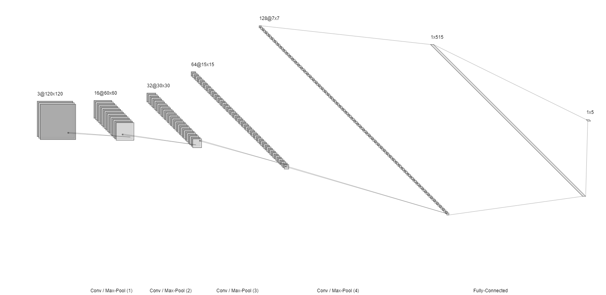
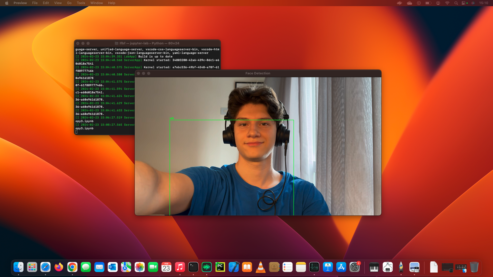

# Face Detection Project using CNN

<p style="text-align: justify;">
By studying machine learning concepts and architectures, I developed a simple 
project to test and enhance my knowledge in the field. This project involves creating 
a program that detects faces in real-time using a machine learning algorithm. The 
algorithm collects images from the user and trains them using a Convolutional Neural Network (CNN), enabling real-time classification through the webcam.
</p>

## Table of Contents

- [General Overview](#general-overview)
- [Architecture Overview](#architecture-overview)
- [Summary](#summary)
- [Dependencies](#dependencies)
- [Installation](#installation)
- [Usage](#usage)
- [License](#license)
  
## General Overview
For building this model, I used **PyTorch**, which allowed me to manually manage the model and to learn in practise how to build from scratch.
[](CNN.png)
*Visual representation of the CNN architecture.*

### Architecture Overview

1. **Input**: 120x120x3 (RGB Image)
<br>

2. **Conv Layer 1**:
   - Convolution: 16 filters, 3x3 kernel, stride=1, padding=1
   - Batch Normalization + ReLU
   - Max Pooling: 2x2, stride=2
   - **Output**: 60x60x16
<br>

3. **Conv Layer 2**:
   - Convolution: 32 filters, 3x3 kernel, stride=1, padding=1
   - Batch Normalization + ReLU
   - Max Pooling: 2x2, stride=2
   - **Output**: 30x30x32
<br>

4. **Conv Layer 3**:
   - Convolution: 64 filters, 3x3 kernel, stride=1, padding=1
   - Batch Normalization + ReLU
   - Max Pooling: 2x2, stride=2
   - **Output**: 15x15x64
<br>

5. **Conv Layer 4**:
   - Convolution: 128 filters, 3x3 kernel, stride=1, padding=1
   - Batch Normalization + ReLU
   - Max Pooling: 2x2, stride=2
   - **Output**: 7x7x128
<br>

6. **Flatten**: The 7x7x128 output is flattened into a 1D vector of size 6272.
<br>

7. **Fully Connected Layer 1**:
   - Input: 6272
   - Output: 512 neurons
<br>

8. **Fully Connected Layer 2 (Output Layer)**:
   - Input: 512 neurons
   - Output: 5 neurons, **1 channel for the classifier (0, 1... It depends on how many subjects) and 4 channels for the Boundaries Boxes.**

## Summary
- The network progressively reduces the spatial size through max pooling while increasing the depth with more filters.
- After the convolutional layers, the features are flattened and passed through fully connected layers for classification.
- Finally, after training, the model is loaded and images taken in real time, by the webcam, are passed through the model resulting into a ***classifier*** and a ***Bbox***.




*Result of the model working properly identifying me and drawing the Boundary Box.*

## Dependencies
For running the Notebook correctly you will need to install the following Dependencies:

#### 1. Install **PyTorch**:

    https://pytorch.org/get-started/locally/

#### 2. Install **OpenCV**:

```bash
 pip install opencv-python
 ```
#### 3. Install **LabelMe**:
This part will be important because **LabelMe** does all the process of classifying your 
images and generating labels for them much more easily:

- [LabelMe](https://github.com/wkentaro/labelme/releases/tag/v5.5.0)

## Usage

#### 1. To run the Notebook, I recomend using Jupyter Lab itself:
```bash
pip install jupyterlab
```
Or You can use any IDE of your own choice. 

#### 2. Follow the steps inside the Notebook.


## License
This project is licensed under the [Apache License 2.0](LICENSE).
